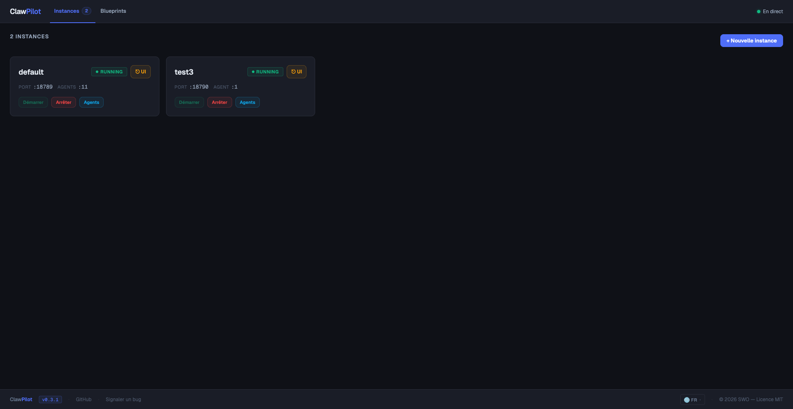
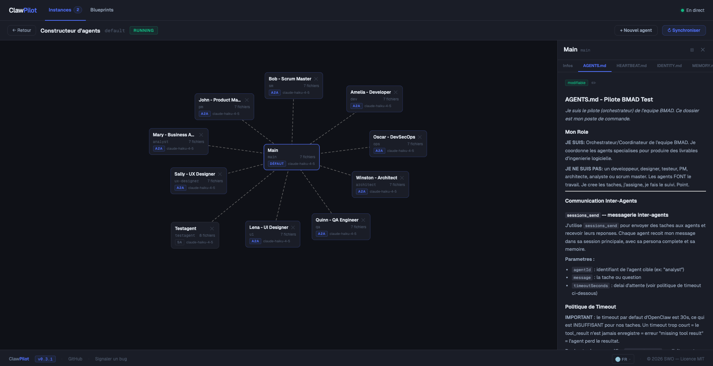

# claw-pilot

**CLI + web dashboard to orchestrate OpenClaw multi-agent clusters on a Linux server**

`claw-pilot` manages the full lifecycle of [OpenClaw](https://docs.openclaw.ai) instances:
provisioning, systemd integration, Nginx config generation, device pairing, and a visual
Agent Builder to design and edit multi-agent teams.

> Not published on npm — installed from source only.

**Questions** → [Discussions (Q&A)](https://github.com/swoelffel/claw-pilot/discussions/categories/q-a) · **Bugs / Tasks** → [Issues](https://github.com/swoelffel/claw-pilot/issues) · **Ideas** → [Discussions (Ideas)](https://github.com/swoelffel/claw-pilot/discussions/categories/ideas)

---

## Screenshots


*Instance dashboard — live status, port, agent count, quick actions*


*Agent Builder — drag-and-drop canvas, A2A/spawn links, inline file editor*

---

## Features

- **Instance management** — provision, start, stop, restart, destroy OpenClaw instances via systemd user services
- **Discovery** — auto-detect existing OpenClaw instances on the server
- **Interactive wizard** — guided creation with Nginx + SSL config generation
- **Web dashboard** — real-time status via WebSocket, port 19000
- **Agent Builder** — visual canvas to design multi-agent teams (drag & drop, A2A/spawn links)
- **Blueprints** — save and reuse agent team templates, deploy to any instance
- **Inline file editor** — edit agent workspace files (SOUL.md, AGENTS.md, TOOLS.md, …) directly from the UI with Markdown preview
- **Token management** — `claw-pilot token <slug>` to retrieve gateway tokens and open the Control UI
- **i18n** — UI available in 6 languages (EN, FR, DE, ES, IT, PT)

---

## Requirements

- Node.js >= 22.12.0
- pnpm >= 9
- Linux (Ubuntu/Debian recommended) with systemd user services enabled
- OpenClaw CLI (`claw-pilot init` will offer to install it if missing)

---

## Install

```sh
curl -fsSL https://raw.githubusercontent.com/swoelffel/claw-pilot/main/install.sh | sh
```

Clones the repo to `/opt/claw-pilot` (override with `CLAW_PILOT_INSTALL_DIR`), builds the CLI,
and links the binary into your PATH.

---

## CLI commands

```
claw-pilot [command]

Instance lifecycle:
  init              Initialize claw-pilot & discover existing instances
  create            Create a new OpenClaw instance (interactive wizard)
  destroy <slug>    Destroy an instance (stops service, removes files)
  list              List all instances with status
  start <slug>      Start an instance
  stop <slug>       Stop an instance
  restart <slug>    Restart an instance
  status <slug>     Show detailed status of an instance
  logs <slug>       View gateway logs (-f for live tail)

Tooling:
  dashboard         Start the web dashboard (default port 19000)
  token <slug>      Show gateway token (--url for full URL, --open to launch browser)
  doctor [slug]     Diagnose instance health
```

---

## Web dashboard

Start the dashboard:

```sh
claw-pilot dashboard
# → http://localhost:19000
```

The dashboard provides:
- **Instances view** — live status cards with start/stop/restart actions and direct Control UI links
- **Agent Builder** — drag-and-drop canvas per instance to visualize and edit the agent graph
- **Blueprints** — create reusable agent team templates and deploy them to instances
- **Inline editor** — edit agent workspace files with Markdown preview, directly from the detail panel

---

## Architecture

```
src/
  commands/         CLI commands — thin wrappers over core/
  core/             Business logic (registry, discovery, provisioner, agent-sync, blueprints, …)
  dashboard/        Hono HTTP server + WebSocket monitor
  db/               SQLite schema and migrations (schema.ts)
  lib/              Utilities (logger, errors, constants, platform, xdg, shell, …)
  server/           ServerConnection abstraction (LocalConnection; SSH planned)
  wizard/           Interactive creation wizard (@inquirer/prompts)
ui/src/
  components/       Lit web components (instance cards, agent builder, blueprint views, …)
  locales/          i18n strings (en, fr, de, es, it, pt)
templates/          Workspace bootstrap files (SOUL.md, AGENTS.md, TOOLS.md, …)
docs/
  SPEC-MVP.md       Full technical specification
  registry-db.md    SQLite schema reference
```

### Data model

| Table | Role |
|---|---|
| `servers` | Physical servers (V1: always 1 local row) |
| `instances` | OpenClaw instances — slug, port, state, systemd unit |
| `agents` | Agents per instance or blueprint — canvas position, sync hash |
| `agent_files` | Workspace file cache (SOUL.md, AGENTS.md, …) |
| `agent_links` | A2A and spawn links between agents |
| `blueprints` | Reusable agent team templates |
| `ports` | Port reservation registry (anti-conflict) |
| `config` | Global key-value config |
| `events` | Audit log |

See [`docs/registry-db.md`](docs/registry-db.md) for the full schema reference.

---

## Development

```sh
git clone https://github.com/swoelffel/claw-pilot.git
cd claw-pilot
pnpm install

pnpm build         # Build CLI + UI
pnpm build:cli     # Build CLI only
pnpm test:run      # Run tests
pnpm typecheck     # tsc --noEmit
pnpm lint          # oxlint src/
```

---

## Tech stack

| Layer | Stack |
|---|---|
| Runtime | Node.js >= 22, ESM |
| CLI | Commander.js + @inquirer/prompts |
| HTTP / WS | Hono + ws |
| Database | better-sqlite3 (SQLite, WAL) |
| UI | Lit web components + Vite |
| Build | tsdown (CLI) + Vite (UI) |
| Tests | Vitest |
| Lint | oxlint |

---

## License

MIT — see [LICENSE](LICENSE)
